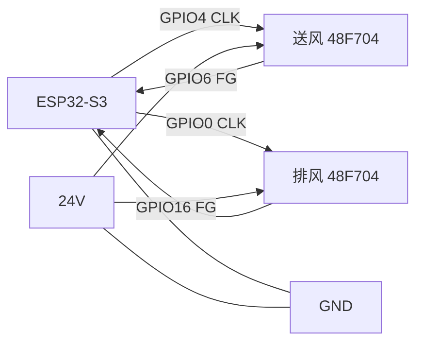

# 热交换新风机（ESPHome）

基于 **Guition ESP32-S3-4848S040**（480×480 触控屏）+ [esphome-modular-lvgl-buttons](https://github.com/agillis/esphome-modular-lvgl-buttons) 的全热交换新风机控制方案。

> 仍使用 **Waveshare ESP32-S3-Touch-LCD-4** 时见 [README 附录](#附录waveshare-esp32-s3-touch-lcd-4) 与 `packages/pinmap_waveshare_lcd4.yaml`。

| 文档 | 内容 |
|------|------|
| [PINOUT.txt](PINOUT.txt) | GPIO、MCP 引脚、I2C 地址、供电 |
| [docs/TVOC_SENSOR.md](docs/TVOC_SENSOR.md) | TVOC 传感器选型、接线、HA/ESPHome 接入 |
| [secrets.yaml.example](secrets.yaml.example) | Wi-Fi / API / OTA 模板 |
| 下文 § 风机 CLK/FG | Nidec 48F704P400 等 ECM 接线 |
| 下文 § 35BYJ 接线 | MCP / ULN / 电机照片级线表 |

---

## 项目完成度

| 模块 | 状态 | 文件 |
|------|------|------|
| ESP32 + I2C 总线 | ✅ | `packages/hardware_bus.yaml` |
| 传感器 SHT31×2 / SCD30 / PMS5003 | ✅ | `packages/sensors.yaml` |
| 同城 PM2.5（HA 联网） | ✅ | `packages/city_pm25.yaml` |
| 送风/排风 24V 风机 | ✅ | `packages/fan.yaml` |
| 三路风阀 + 进风摆风 + 归零 | ✅ | `packages/actuators.yaml` |
| 启停联锁脚本 + HA 按钮 | ✅ | `packages/erv_interlock.yaml` |
| Wi-Fi / API / OTA | ✅ | `air-exchange.yaml`（需 `secrets.yaml`） |
| 触控 LVGL 界面 | ✅ 初版 | `air-exchange-display.yaml` + `packages/display_ui.yaml` |
| 自动温控 / CO₂ / PM 策略 | ❌ 未做 | 可在 HA automation 或后续加 |
| 关限位开关模式 `limit` | ⚠️ 占位 | 仅日志提示，需自行恢复 binary_sensor |

当前配置可在 **无触摸屏** 下编译烧录，用 Home Assistant 控风阀与风机。

已本地通过 `esphome config air-exchange.yaml` 校验（需 `secrets.yaml`）。HA 实体 `name` 使用英文 ID（如 `sht_indoor_temp`），避免中文名被 ESPHome 判为重复；可在 HA 里改友好显示名。

---

## 仓库结构

```
air-exchange/
├── README.md
├── PINOUT.txt
├── secrets.yaml.example
├── air-exchange.yaml           # 无屏调试
├── air-exchange-display.yaml   # 带 LVGL 触控（正式用屏烧这个）
├── i2c-scan.yaml               # 辨别开发板 V3/V4
└── packages/
    ├── hardware_bus.yaml       # 最小 ESP32+I2C（无屏）
    ├── display_ui.yaml         # LVGL 页面骨架
    ├── sensors.yaml
    ├── fan.yaml
    ├── actuators.yaml
    ├── erv_interlock.yaml
    ├── city_pm25.yaml           # 从 HA 订阅同城 PM2.5
    ├── pinmap.yaml              # Guition 4848 风机/PMS 引脚（默认）
    └── pinmap_waveshare_lcd4.yaml  # 微雪 LCD-4 备用
```

---

## 显示分辨率（固定 480×480）

线控/触控面板仅支持 **480×480** 像素。固件里 `screen_width` / `screen_height` 已为 `"480"`（见 `air-exchange.yaml`、`air-exchange-display.yaml`）；LVGL 布局、切图、预览图均按此尺寸设计，勿用其它比例。

界面 mockup（**原生 480×480**，与 `air-exchange` 功能一致：全热交换 / 启动·停止·摆风 / 送排风%；可改 `panel-ui-480.html` 后重新导出）：

- 导出图：[`assets/air-exchange-panel-480x480.png`](assets/air-exchange-panel-480x480.png)
- 可编辑源稿：[`assets/panel-ui-480.html`](assets/panel-ui-480.html)（改文案/数值后用 Chrome 无头截图）

```bash
"/Applications/Google Chrome.app/Contents/MacOS/Google Chrome" \
  --headless=new --window-size=480,480 --force-device-scale-factor=1 \
  --screenshot=assets/air-exchange-panel-480x480.png \
  "file://$(pwd)/assets/panel-ui-480.html"
```

## LVGL 触控界面

烧录 **`air-exchange-display.yaml`**（需 ESPHome **≥ 2026.4**）。

1. 本仓库已含 `vendor/esphome-modular-lvgl-buttons`，根目录有符号链接 `esphome-modular-lvgl-buttons`（主题字体路径依赖此名）。
2. 亦可自行克隆到同级，并创建同名符号链接。
3. 默认整机为 **Guition 4848S040**；`hardware` 已指向 `guition-esp32-s3-4848s040.yaml`，**无需** `waveshare_io_ch32v003`。
4. 外设须按 [PINOUT.txt](PINOUT.txt) 重接（I2C **19/45**，风机 **35/36/37/33**，PMS **43/44**）。

### main_page（日立风格）

| 资源 | 说明 |
|------|------|
| [`assets/bg-640.png`](assets/bg-640.png) | 全屏背景（640×640 源图，烧录时缩放到 480×480） |
| [`assets/element.jpg`](assets/element.jpg) | 控件位置对照图（**仅文档**，不进固件） |
| [`assets/UI_LAYOUT.md`](assets/UI_LAYOUT.md) | 坐标、配色阈值、待做底部按钮 |

**已实现**：顶栏 Wi-Fi + 时间；室内温湿度 / PM2.5 / CO₂ / TVOC 等级（绿黄红圆章）；室外温湿度 + 同城 PM2.5。

固件包：`packages/main_page_assets.yaml`、`main_page_ui.yaml`、`main_page_logic.yaml`。

**副页 `ctrl_page`**：送风/排风 ±10%；`main_page` 右下角 **More** 或左右滑动进入。

| 想改 | 文件 |
|------|------|
| 控件坐标 / 文案 | `packages/main_page_ui.yaml` |
| 配色阈值 | `packages/main_page_logic.yaml` |
| 副页按钮 | `air-exchange-display.yaml` 底部 `ui_fan_*` |

```bash
esphome run air-exchange-display.yaml
```

---

## 硬件接线速查

| 外设 | 接法 |
|------|------|
| I2C 总线 | **GPIO19=SDA、GPIO45=SCL** → SHT31×2、SCD30、MCP23017（与 GT911 同 bus） |
| MCP23017 | 默认 **`0x20`**（`i2c-scan.yaml` 确认） |
| ULN2003×3 | MCP 0–11 → 进/排/混 35BYJ-46；电机 **12V** 独立供电 |
| PMS5003 | 板载 UART 座 **GPIO43/44**，5V 供电 |
| 送风 CLK / FG | **GPIO35** PWM→蓝线、**GPIO36**←橙线 |
| 排风 CLK / FG | **GPIO37** PWM→蓝线、**GPIO33**←橙线 |
| 风阀关位 | **无开关**：关向机械挡块（stall 寻零） |

详见 [PINOUT.txt](PINOUT.txt)。

---

## 风机驱动（Nidec 48F704P400，CLK + FG）

实机电机板丝印为 **BRK / FG / CLK / 5V / GND / 24V**，线束为 **红、黑、蓝、橙** 四根；`fan.yaml` 的 LEDC 直连 **CLK（蓝线）**。

| | 送风 `fan_supply` | 排风 `fan_exhaust` |
|--|-------------------|-------------------|
| CLK（PWM 25 kHz） | GPIO4 → 蓝 | GPIO0 → 蓝 |
| FG（转速脉冲） | GPIO6 ← 橙 | GPIO16 ← 橙 |
| 电源 | 红 24V+ / 黑 GND | 同左 |
| 默认转速 | 70% | 50% |
| HA 调速 | `fan_supply_speed_pct` | `fan_exhaust_speed_pct` |

引脚见 `packages/pinmap.yaml`。

### 板端 6 针与线色

| 丝印 | 线色 | 接法 |
|------|------|------|
| 24V | 红 | 24V 开关电源正 |
| GND | 黑 | 24V 负，与 **ESP GND 共地** |
| CLK | 蓝 | ESP **PWM**（3.3V，25 kHz） |
| FG | 橙 | ESP **FG** 脚 + 10kΩ 上拉至 3.3V（固件已 `pullup: true`） |
| BRK | — | 不接 |
| 5V | — | 不接 |

- **CLK**：占空比调速，0%≈停、100%≈满速（具体曲线以电机为准）。
- **FG**：开集电极转速脉冲；转速换算见电机手册「每转脉冲数」。

### 接线示意

```
24V (+) ─────────────── 红 (24V)
24V (-) ──┬──────────── 黑 (GND) ── ESP GND
          │
GPIO4/0 (PWM) ───────── 蓝 (CLK)    送风 GPIO4，排风 GPIO0
GPIO6/16 (FG) ──10kΩ──3.3V── 橙 (FG)
```

### 系统共地示意



**勿**把 24V 接到 ESP 或 MCP；**CLK/FG** 只接规定 GPIO。

---

## 35BYJ-46 + ULN2003 + MCP23017 接线说明

### 物料与电源

| 物料 | 说明 |
|------|------|
| 35BYJ-46 ×3 | 进风 / 排风 / 混风各一，**12V 版** |
| ULN2003 驱动板 ×3 | 板载 4 路 IN + 5 线插座 |
| MCP23017 模块 | I2C，地址跳线 A0/A1/A2 |
| 杜邦线 | SDA/SCL 宜短；电机线可稍长 |

| 电源 | 电压 | 接到 |
|------|------|------|
| 电机电源 | **12V ≥2A** | 三块 ULN 的 **+ / −**（可同一 12V 电源） |
| 逻辑 | 3.3V | MCP VCC、ULN **IN 侧**由 MCP 供电域驱动 |
| ESP | 板载 USB/5V | 与 MCP、ULN **GND 共地** |

### MCP23017 模块（照片级）

```
        MCP23017 模块（俯视常见排针）
        ┌─────────────────────────┐
   3.3V │ VCC                     │
   GND  │ GND                     │
        │ A0 A1 A2  (地址，见下)   │
  GPIO15│ SDA  ───────────────────┼──► 开发板 GPIO15
   GPIO7│ SCL  ───────────────────┼──► 开发板 GPIO7
        │ GPA0 … GPA7  (8P)        │
        │ GPB0 … GPB7  (8P)        │
        └─────────────────────────┘

地址跳线（与本项目 air-exchange.yaml 一致）：
  V3 板：A2 A1 A0 = 0 1 0  → 0x21（避开板载 TCA9554@0x20）
  V4 板：A2 A1 A0 = 0 0 0  → 0x20（板载 CH32V003@0x24）
```

### ULN2003 驱动板（照片级）

```
     ULN2003 板（常见蓝色小板）
     ┌──────────────────────────────────┐
     │  IN1  IN2  IN3  IN4  ← 杜邦线到 MCP │
     │   ○    ○    ○    ○                 │
     │  [LED×4]                          │
     │  5P 插座 ← 插 35BYJ 电机线           │
     │  +  −   ← 12V 电源（进/排/混各板独立或并联）│
     └──────────────────────────────────┘

注意：
  • IN 接 MCP，不要接 ESP 直连。
  • 电机电流只走 ULN 的 +/−，不走 MCP。
```

### 35BYJ-46 五线（常见色序，**以你电机插排为准**）

```
     电机出线 → 插入 ULN 板 5P 插座
     ┌─────────────────┐
     │ 1  2  3  4  5   │  ← 板子丝印有时标 1-5
     └─────────────────┘

常见线色（不同批次会变，第一次必须试转向）：
  红线     → 插座「+」或 12V 公共端（部分板经内部接到 +）
  橙/粉/黄/蓝 四色 → 对应 OUT1–OUT4 内部相序

若板子只有 5P 插座、无单独 +：
  五线全部插入插座，12V 由 ULN 板「+ −」螺丝端子供电。
```

**相序不对时**：电机只抖不转或反转 → 调换插座内四相线顺序，或在固件里改 `stepper_home_close_sign`，或对调同一 ULN 的 IN1↔IN3。

### 三路对应 MCP 引脚（与 `actuators.yaml` 一致）

| 风阀 | MCP 引脚 | → ULN | 35BYJ |
|------|----------|-------|--------|
| 进风 | GPA0–3（0–3） | IN1–IN4 | 第 1 台 |
| 排风 | GPA4–7（4–7） | IN1–IN4 | 第 2 台 |
| 混风 | GPB0–3（8–11） | IN1–IN4 | 第 3 台 |

**接线表（逐根杜邦线）**

| 从 | 到 |
|----|-----|
| MCP `GPA0` | 进风 ULN `IN1` |
| MCP `GPA1` | 进风 ULN `IN2` |
| MCP `GPA2` | 进风 ULN `IN3` |
| MCP `GPA3` | 进风 ULN `IN4` |
| MCP `GPA4` | 排风 ULN `IN1` |
| … | … |
| MCP `GPB2` | 混风 ULN `IN3` |
| MCP `GPB3` | 混风 ULN `IN4` |
| MCP `GND` | 三块 ULN `GND`、ESP `GND` |
| MCP `VCC` | 3.3V（可与 ESP 3.3V 脚同轨） |
| 12V `+` | 三块 ULN `+`（建议星形汇流，线径 ≥22AWG） |
| 12V `−` | ULN `−`、ESP `GND` |

### 整机弱电接线鸟瞰

```
  [ESP32-S3-Touch-LCD-4]
   GPIO15 SDA ─────┬──── MCP SDA
   GPIO7  SCL ─────┤──── MCP SCL
   GPIO4/6   ──► 送风 CLK(蓝) + FG(橙)
   GPIO0/16  ──► 排风 CLK(蓝) + FG(橙)
   GPIO43/44 ──► PMS5003
   GND       ──► 共地点 ★

   MCP GPA0-3  ──► ULN#1 ──► 进风 35BYJ
   MCP GPA4-7  ──► ULN#2 ──► 排风 35BYJ
   MCP GPB0-3  ──► ULN#3 ──► 混风 35BYJ

   [12V 2A] ──► ULN 电机
   [24V]    ──► 送风/排风 ECM（红/黑）
```

### 机械与寻零（无限位开关）

- 每个风阀在 **全关** 位置加塑料/金属 **挡块**，上电寻零时电机顶死挡块即视为 0 步。
- 关向不对：改 `packages/actuators.yaml` 中 `stepper_home_close_sign: "1"` 或对调该阀 IN 线序。

---

## 软件配置步骤

### 1. 依赖

- ESPHome ≥ 2025.1（建议 2026.x）
- 使用触摸屏时克隆 [esphome-modular-lvgl-buttons](https://github.com/agillis/esphome-modular-lvgl-buttons) 到配置目录

### 2. secrets

```bash
cp secrets.yaml.example secrets.yaml
# 编辑 Wi-Fi；api_encryption_key 用 esphome dashboard 生成
```

### 3. 选硬件包

[air-exchange.yaml](air-exchange.yaml) 中二选一：

- **无屏调试（默认）**：保留 `hardware_bus`
- **带触摸屏**：烧 `air-exchange-display.yaml`（已含 Guition hardware 包）

### 4. 编译

```bash
esphome config air-exchange.yaml           # 无屏检查
esphome run air-exchange.yaml              # 无屏烧录
esphome run air-exchange-display.yaml        # 带触摸屏烧录
```

### 5. 标定风阀

1. 确认 `valve_home_mode: stall` 且关位有挡块（或 `manual` + 手动置零）。
2. 上电观察寻零方向，反了则改 `stepper_home_close_sign` 或 ULN 相序。
3. 在 HA 调 **进风/排风/混风开阀步数**，写入 `packages/actuators.yaml` 的 `intake_steps_open` 等固化。

### 6. 运行

HA 中（实体 ID，可在 HA 改友好名）：

- **erv_start** — 开进/排风阀 → 6s → 送风/排风按设定转速运行
- **erv_stop** — 停摆风 → 关风机 → 30s → 关三阀
- **fan_supply_speed_pct** / **fan_exhaust_speed_pct** — 0–100%，关机可预设
- **intake_swing** / **valves_rehome** / **valves_manual_zero**

混风阀默认不在 `erv_start` 里打开；旁通模式需在 HA 单独调 `mix_valve_open_script` 或后续加自动化。

---

## 同城 PM2.5（联网）

ESPHome **不自带**「按城市查 PM2.5」接口；推荐在 **Home Assistant** 里先接入同城空气质量，再由 ESP 通过 Native API 订阅显示。

| 数据 | 来源 | ESP 实体 `id` |
|------|------|----------------|
| 室内实测 | 本机 PMS5003 | `pm25` |
| 同城联网 | HA 里已有传感器 | `pm25_city` |

### 1. 在 Home Assistant 获取同城 PM2.5

任选一种（需能拿到 **µg/m³** 数值型 `sensor.*`）：

| 方式 | 说明 |
|------|------|
| **和风天气** | 设置 → 设备与服务 → 添加「Qweather / 和风天气」→ 填 API Key 与所在城市 → 会出现 PM2.5 类传感器 |
| **Open-Meteo** | 集成按经纬度提供空气质量（含 PM2.5） |
| **WAQI** | [World Air Quality Index](https://waqi.info/)，选离你最近的监测站 |
| **其它** | 各省环保、第三方 HACS 集成，只要最终在 HA 里是 `sensor.xxx` 即可 |

在 HA：**设置 → 实体** 里找到 PM2.5 实体，复制 **实体 ID**（例如 `sensor.shanghai_pm2_5`）。

### 2. 写入 ESP 的 secrets

`secrets.yaml`（由 `secrets.yaml.example` 复制）增加：

```yaml
city_pm25_entity_id: "sensor.shanghai_pm2_5"   # 改成你的实体 ID
```

固件已 `!include packages/city_pm25.yaml`（`air-exchange.yaml` / `air-exchange-display.yaml`）。

### 3. 屏上显示（带 LVGL 时）

主页右上角磁贴 **City PM** 绑定 `pm25_city`；左上角 **In PM** 仍是本机 PMS5003。

室外 **SHT31 温湿度** 仍在「Out RH」等磁贴；室外 **温度** 可在 HA 看 `sht_outdoor_temp`（主页 4×4 格已满，未单独占一格）。

### 4. 无 Home Assistant 时

同城数据需 ESP 自己 `http_request` 调 OpenWeather **Air Pollution** 等 API（要 API Key + 经纬度，且占 RAM）。本仓库默认走 HA 路径；若你坚持单机联网，可再开 issue 加 `packages/city_pm25_owm.yaml` 示例。

### 5. 与新风逻辑配合（示例）

在 HA 自动化：同城 PM2.5 低且室内 CO₂ 高 → `erv_start`；同城很差 → 保持 `erv_stop` 或降低进风量（按你阀位策略）。

---

## 外设概要

| 类别 | 器件 |
|------|------|
| 显示 | Guition 4848S040，4″ 480×480 LVGL |
| 环境 | SHT31 室内/外、SCD30 CO₂、PMS5003 室内 PM2.5、HA 同城 PM2.5 |
| 执行 | 送风/排风 ECM（如 48F704P400，CLK/FG）；35BYJ×3 + ULN2003；MCP23017 |
| 风阀 | 固定关 0 / 各自开角；默认挡块寻零 |

### 风阀归零（无关限位）

| 模式 | 配置 | 说明 |
|------|------|------|
| `stall` | 默认 | 上电顶关位挡块 → 置 0 |
| `manual` | `valve_home_mode: "manual"` | 点「风阀确认已关闭」置 0 |
| `limit` | 未实现完整逻辑 | 需自接 MCP 12/13/14 |

---

## 相关链接

- [Guition 4848S040 — ESPHome Devices](https://devices.esphome.io/devices/guition-esp32-s3-4848s040/)
- [esphome-modular-lvgl-buttons](https://github.com/agillis/esphome-modular-lvgl-buttons)

---

## 附录：Waveshare ESP32-S3-Touch-LCD-4

若仍用微雪 4″ 板（非本仓库默认）：

1. `air-exchange-display.yaml` 中改 `hardware` 为 `waveshare-esp32-s3-touch-lcd-4-v4.yaml`（V3 用 `-4.yaml`）。
2. 恢复 `external_components` 的 `waveshare_io_ch32v003`。
3. `device_pins` 改为 `packages/pinmap_waveshare_lcd4.yaml`。
4. I2C **GPIO15/7**；风机 **4/6/0/16**；MCP **0x21**（V3）或 **0x20**（V4，避开 CH32 `0x24`）。

```bash
esphome run i2c-scan.yaml   # 4848 板请用当前仓库 i2c-scan（19/45）
```

| 版本 | hardware 包 | `mcp_valves_address` |
|------|-------------|----------------------|
| V3 | `waveshare-esp32-s3-touch-lcd-4.yaml` | `0x21` |
| V4 | `waveshare-esp32-s3-touch-lcd-4-v4.yaml` | `0x20` |

[Waveshare Wiki](https://www.waveshare.com/wiki/ESP32-S3-Touch-LCD-4)
